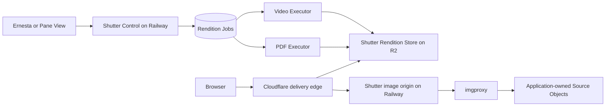

# Shutter

Shutter is a private rendition service for applications that own their uploads,
media records, storage, and end-user authorization but need on-demand image
optimization and stored video or PDF thumbnails.

It is product-neutral infrastructure for private applications such as Ernesta
and Latch Works. It is not a public media SaaS and does not own application
users, business records, or application storage provisioning.

## Shape



See [the architecture record](./docs/architecture.md), [decisions](./docs/adr/),
and [foundation roadmap](./docs/plans/0001-shutter-foundation.md).

## Development

Shutter is a private TypeScript workspace using Node 22 and pnpm 11.1. The
deployable applications live under `apps/`; shared Web-standard protocol,
Space configuration, and conformance fixtures live under `packages/`.

```sh
pnpm install --frozen-lockfile
pnpm check
```

`pnpm check` verifies formatting and runtime boundaries, generated Worker
types, TypeScript, Node and workerd tests, and every application build. Phase 1
contains fail-closed service shells only; it does not provision or deploy
Cloudflare, R2, Railway, Postgres, or imgproxy resources.
