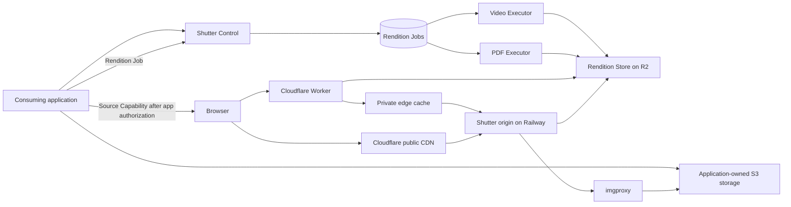

# Shutter

[](https://github.com/Traydr/shutter/actions/workflows/ci.yml)
[](./LICENSE)

Shutter is a rendition service: it turns images, videos, and PDFs that your
application already owns into optimized WebP renditions and durable thumbnails,
without ever taking custody of your uploads, your media catalog, your users, or
your authorization rules.

Most image CDNs solve this by becoming the system of record — you upload to
them, they own the bytes, and private media either leaks into a public URL space
or forces you to proxy every request through your own app. Shutter takes the
opposite position: **the application stays the authority, and Shutter never
learns its domain model.** Applications issue short-lived, encrypted capability
tokens for the sources they are willing to expose; Shutter validates those
tokens at the edge and renders only what a token authorizes.

## How it works



A Cloudflare Worker decrypts and validates a private Source Capability **before**
any cache lookup, so an authorization failure can never be served from cache.
Public renditions take a separate canonical path through ordinary CDN caching.
Railway hosts the control plane, imgproxy, a Postgres job ledger, and isolated
video and PDF executors that write Master Previews to R2.

## Design decisions worth reading

The interesting part of this repo is the reasoning as much as the code. Twenty
[architecture decision records](./docs/adr/) cover the tradeoffs, and the
[v1 contracts](./docs/contracts/v1/) pin the wire behavior each consumer can
depend on.

- **[Keep storage and authorization with applications](./docs/adr/0001-keep-storage-and-authorization-with-applications.md)** — why Shutter refuses to own uploads or users.
- **[Encrypt source capabilities](./docs/adr/0016-encrypt-source-capabilities.md)** — locators are encrypted, not merely signed, so a URL never leaks a storage path.
- **[Authorize before private cache lookups](./docs/adr/0008-authorize-before-private-cache-lookups.md)** — the ordering constraint that makes private caching safe.
- **[Separate source identity from location](./docs/adr/0018-separate-source-identity-from-location.md)** — an immutable Source ID drives cache keys and job identity while the fetch locator stays replaceable.
- **[Require immutable source objects](./docs/adr/0003-require-immutable-source-objects.md)** — changed bytes are a different source, which removes cache invalidation as a category of bug.

A few properties fall out of those decisions:

- **Fail-closed by construction.** URLs and capabilities carry an explicit `v1`
  version, so incompatible drift rejects rather than degrades.
- **Deterministic cache identity.** Cache keys derive from a SHA-256 fingerprint
  over `(protocol version, space, source id)`, so every component computes the
  same key without coordination.
- **Enforced runtime boundary.** `scripts/check-edge-boundary.mjs` fails the
  build if Worker code reaches for Node APIs; the Worker runs on Web standards
  only, with no `nodejs_compat`.
- **Conformance fixtures, not just tests.** `@shutter/testkit` ships versioned
  fixtures for capability encryption, URL construction, and normalization that
  every consumer runs against its own adapter.

## Layout

| Path | What lives there |
| --- | --- |
| `apps/edge` | Cloudflare Worker: capability validation, private cache, R2 reads |
| `apps/control` | Control plane: job API, ledger, purge, imgproxy signing |
| `apps/executor-video`, `apps/executor-pdf` | Isolated Master Preview executors |
| `packages/protocol` | Capability crypto, URL construction, cache identity |
| `packages/space-config` | Per-tenant policy: trusted origins, quality ladders |
| `packages/testkit` | Cross-consumer conformance fixtures |

## Development

TypeScript workspace on Node 22 and pnpm 11.1.

```sh
pnpm install --frozen-lockfile
pnpm check
```

`pnpm check` runs formatting, the runtime-boundary and config lints, TypeScript,
the Node and `workerd` test suites, and every application build. The Control
tests start a throwaway Postgres through testcontainers, so `pnpm test` needs a
running container runtime (Docker, OrbStack, or Podman).

The two Spaces in `packages/space-config` (`demo-public` and `demo-private`) are
illustrative tenant policies. Deployment-specific values — custom domains, the
imgproxy source allowlist, storage credentials, and the OTLP endpoint — are not
in this repo; see [`.railway/railway.ts`](./.railway/railway.ts) for the shape
and [the runbooks](./docs/runbooks/) for the operational procedures.

## License

MIT — see [LICENSE](./LICENSE).
