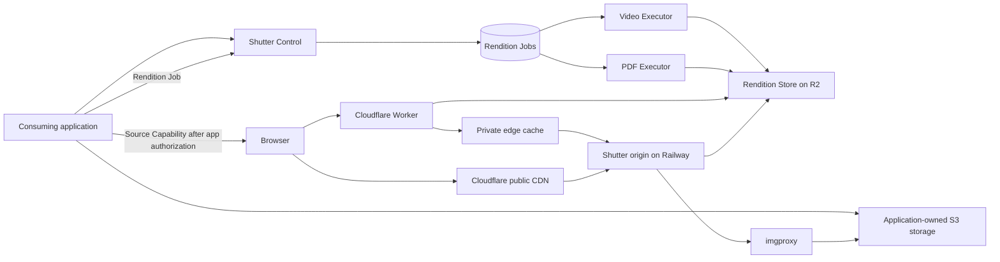

<p align="center">
  <strong>Optimized renditions for media your application already owns</strong><br/>
  <strong>Image Optimization • Video &amp; PDF Previews • Private Delivery</strong><br/>
  <sub>Resize and WebP-encode on demand. Materialize video posters and PDF covers. Serve private media through the edge without ever handing over your storage, your users, or your authorization rules.</sub>
</p>

<p align="center">
  <a href="./docs/architecture.md">Architecture</a> ·
  <a href="./docs/adr/">Decision records</a> ·
  <a href="./docs/contracts/v1/">v1 contracts</a> ·
  <a href="./docs/development.md">Development</a> ·
  <a href="./docs/runbooks/">Runbooks</a>
</p>

<p align="center">
  <a href="https://github.com/Traydr/shutter/actions/workflows/ci.yml"></a>
  <a href="./LICENSE"></a>
</p>

# Shutter

Shutter is a rendition service for applications that keep their own uploads,
storage, media records, and end-user authorization. It turns images, videos, and
PDFs into optimized WebP renditions and durable thumbnails without taking custody
of any of it.

**The application stays the authority, and Shutter never learns its domain
model.** Most image CDNs solve this by becoming the system of record — you upload
to them, they own the bytes, and private media either leaks into a public URL
space or forces you to proxy every request through your own app. Shutter takes
the opposite position: applications issue short-lived, encrypted capability
tokens for the sources they are willing to expose, and Shutter renders only what
a token authorizes.

<table>
<tr>
<td width="42%" valign="top">

### Image Optimization

Resize to a requested width and WebP-encode at a requested quality, preserving
composition. Widths and qualities come from Space policy, not from the caller;
non-canonical public values redirect once to their canonical form and cache
there.

</td>
<td width="58%" valign="top">

```text
GET /v1/public/{space}/resolver/{resolver}/{ref}?w=1200&q=75
GET /v1/public/{space}/located/{sourceId}/{cap}?w=1200&q=75
```

</td>
</tr>
<tr>
<td width="42%" valign="top">

### Video &amp; PDF Master Previews

One durable Derivative per source: a one-second video frame with
first-decodable-frame fallback, or the first PDF page, encoded as quality-90 WebP
within 1920px. Every responsive thumbnail is an Image Optimization of that
master. Jobs are keyed by `(space, source, kind)` — no client-side idempotency
key, no duplicate work.

</td>
<td width="58%" valign="top">

```http
PUT /v1/spaces/{space}/sources/{sourceId}/previews/video
Authorization: Bearer <space-api-token>

{ "sourceCapability": "v1.<kid>.<iv>.<ciphertext-and-tag>" }
```

```json
{
  "status": "ready",
  "master": {
    "sourceId": "application-issued-source-id",
    "kind": "video", "width": 1920, "height": 1080,
    "format": "webp"
  }
}
```

</td>
</tr>
<tr>
<td width="42%" valign="top">

### Private Delivery

A Cloudflare Worker decrypts and validates the capability **before** any cache
lookup, so an authorization failure can never be served from cache. Browser
responses are `private, no-store`; the internal cache key excludes the expiring
capability so hits still survive token rotation.

</td>
<td width="58%" valign="top">

```text
GET /v1/private/{space}/source/{cap}?w=1200&q=75
GET /v1/private/{space}/master/{cap}?w=1200&q=75
```

</td>
</tr>
</table>

<p align="center">
  <sub><strong>Full wire behavior:</strong> <a href="./docs/contracts/v1/rendition-urls.md">rendition URLs</a> ·
  <a href="./docs/contracts/v1/job-api.md">job API</a> ·
  <a href="./docs/contracts/v1/source-capability.md">source capability</a> ·
  <a href="./docs/contracts/v1/source-purge.md">source purge</a></sub>
</p>

---

## Usage

Your application mints capabilities and builds URLs with `@shutter/protocol`.
Nothing about the source leaves your side except what a single capability
authorizes.

### Issue a capability

```ts
import { issueSourceCapability, buildPrivateSourceUrl } from "@shutter/protocol";

const now = Math.floor(Date.now() / 1000);

// after your own authorization check for this user and this media record
const capability = await issueSourceCapability(
  {
    space_id: "demo-private",
    source_id: "media_01H8...",   // immutable; changed bytes are a new source
    purpose: "image_source",
    locator: presignedGetUrl,      // replaceable; identity does not depend on it
    iat: now,
    exp: now + 300,
  },
  { kid: "key-2026-07", key: spaceKey },
);

const src = buildPrivateSourceUrl("demo-private", capability, {
  width: 1200,
  quality: 75,
});
```

Three purposes, each bound to exactly one job: `image_source` optimizes a private
original, `master_preview` reads a stored Derivative, `preview_job` runs one
bounded Rendition Job. A capability carries a Source Locator only when its
purpose has to fetch your bytes.

### Request a Master Preview

```ts
import { buildPreviewJobUrl } from "@shutter/protocol";

await fetch(controlBaseUrl + buildPreviewJobUrl(space, sourceId, "video"), {
  method: "PUT",
  headers: {
    authorization: `Bearer ${spaceApiToken}`,
    "content-type": "application/json",
  },
  body: JSON.stringify({ sourceCapability }),
});
```

`202` while pending or processing (with `Location` and `Retry-After`), `200`
once the job reaches `ready` or a persisted `failed`. Poll the same canonical
`GET`; the JSON `status` is authoritative. Repeat `PUT`s are safe — a fresh
capability reactivates a `source_expired` or `attempts_exhausted` job on the same
record.

### Purge a source

```text
POST /v1/spaces/{space}/sources/{sourceId}/purge
```

After you have made the original unavailable. It removes every cached Rendition,
stored Derivative, and Rendition Job for that immutable identity. It does not
revoke an otherwise-valid capability — short lifetimes do that.

---

## How it works



### Private image request

```text
Browser requests a private rendition URL
  -> Worker decrypts the capability and checks purpose, space, source, expiry
  -> Reject: 401/403, nothing is cached, no cache is consulted
  -> Normalize w and q, derive the internal cache key (capability excluded)
  -> Private edge cache hit: serve, still validated on every lookup
  -> Miss: origin on Railway -> imgproxy -> application storage via locator
  -> Respond `private, no-store`; store a clone at the internal key for 24h
```

### Master Preview job

```text
Application PUTs a preview_job capability
  -> Control creates or returns the job at (space, source, kind)
  -> Executor claims one job, heartbeats, invokes ffmpeg or poppler
  -> Master Preview uploaded to the Rendition Store on R2
  -> Job reaches ready with real width, height, and format
  -> Application builds the public or private master URL from that descriptor
```

Control never authorizes end users and never mints delivery capabilities. The
ready descriptor contains no URL, no locator, and no capability.

---

## Design decisions worth reading

The interesting part of this repo is the reasoning as much as the code. Twenty
[architecture decision records](./docs/adr/) cover the tradeoffs; the
[v1 contracts](./docs/contracts/v1/) pin the wire behavior each consumer can
depend on.

| Decision | Why it matters |
|---|---|
| [Keep storage and authorization with applications](./docs/adr/0001-keep-storage-and-authorization-with-applications.md) | Why Shutter refuses to own uploads or users |
| [Encrypt source capabilities](./docs/adr/0016-encrypt-source-capabilities.md) | Locators are encrypted, not merely signed, so a URL never leaks a storage path |
| [Authorize before private cache lookups](./docs/adr/0008-authorize-before-private-cache-lookups.md) | The ordering constraint that makes private caching safe |
| [Separate source identity from location](./docs/adr/0018-separate-source-identity-from-location.md) | An immutable Source ID drives cache and job identity while the locator stays replaceable |
| [Require immutable source objects](./docs/adr/0003-require-immutable-source-objects.md) | Changed bytes are a different source, which removes cache invalidation as a category of bug |

A few properties fall out of those decisions:

- **Fail-closed by construction.** URLs and capabilities carry an explicit `v1`
  version, so incompatible drift rejects rather than degrades. Missing
  configuration returns 401/503 on the affected route instead of booting a
  half-configured service.
- **Deterministic cache identity.** Cache keys derive from a SHA-256 fingerprint
  over `(protocol version, space, source id)`, so every component computes the
  same key without coordination.
- **Enforced runtime boundary.** `scripts/check-edge-boundary.mjs` fails the
  build if Worker code reaches for Node APIs; the Worker runs on Web standards
  only, with no `nodejs_compat`.
- **Conformance fixtures, not just tests.** `@shutter/testkit` ships versioned
  fixtures for capability encryption, URL construction, and normalization that
  every consumer runs against its own adapter.

---

## Layout

| Path | What lives there |
|---|---|
| `apps/edge` | Cloudflare Worker: capability validation, private cache, R2 reads |
| `apps/control` | Control plane: job API, ledger, purge, imgproxy signing |
| `apps/executor-video`, `apps/executor-pdf` | Isolated Master Preview executors |
| `packages/protocol` | Capability crypto, URL construction, cache identity |
| `packages/testkit` | Cross-consumer conformance fixtures |
| `packages/executor-runtime` | Shared claim, heartbeat, upload, and cleanup work cycle |
| `packages/observability-node` | Structured logging and OTLP export for Node services |

---

## Development

TypeScript workspace on Node 22 and pnpm 11.1.

```sh
pnpm install --frozen-lockfile
pnpm check
```

`pnpm check` runs formatting, the runtime-boundary and config lints, TypeScript,
the Node and `workerd` test suites, and every application build. The Control
tests start a throwaway Postgres through testcontainers, so `pnpm test` needs a
running container runtime (Docker, OrbStack, or Podman).

To run the services, copy `.env.example` to `.env` (and
`apps/edge/.dev.vars.example` to `apps/edge/.dev.vars`) and fill in what you
need — everything is fail-closed, so you can enable one capability at a time.
The video Executor needs `ffmpeg` on `PATH`; the PDF Executor also needs
`poppler-utils`.

```sh
pnpm --filter @shutter/control db:migrate   # Space Registry and Rendition Job ledger
pnpm --filter @shutter/control dev          # Control plane on :3000
```

[docs/development.md](./docs/development.md) covers running each service, the
conventions the build enforces, and a known version gap that stops the edge dev
server from booting.

<details>
<summary>Core configuration</summary>

| Variable | Description |
|---|---|
| `DATABASE_URL` | Postgres for the Space Registry and Rendition Job ledger |
| `SHUTTER_ENCRYPTION_KEY` | Master key for Capability Keys stored in the Space Registry |
| `EDGE_CONFIG_TOKEN` | Dedicated credential shared by Control and Edge for snapshot reads |
| `S3_ENDPOINT`, `S3_BUCKET`, `S3_*` | Rendition Store, shared verbatim with imgproxy and both Executors |
| `IMGPROXY_BASE_URL`, `IMGPROXY_KEY`, `IMGPROXY_SALT`, `IMGPROXY_SECRET` | On-demand image rendering |
| `EDGE_BASE_URL`, `ORIGIN_AUTH_TOKEN` | Delivery edge; the token must match the Worker's value exactly |
| `VIDEO_EXECUTOR_*`, `PDF_EXECUTOR_*` | Executor callbacks; tokens must match each Executor's `EXECUTOR_ROLE_TOKEN` |
| `CLOUDFLARE_ZONE_ID`, `CLOUDFLARE_CACHE_PURGE_TOKEN` | Only needed to exercise Source Purge end to end |
| `OTEL_EXPORTER_OTLP_LOGS_*` | Optional log export; unset means stdout only. See [logging](./docs/runbooks/logging.md) |

See [`.env.example`](./.env.example) for the annotated full set.

</details>

<details>
<summary>Spaces and deployment values</summary>

Space policies, API tokens, and Capability Keys are records in Postgres. They
are changed through the Space Registry and are not deployment variables or
checked-in tenant configuration.

Deployment-specific values — custom domains, the imgproxy source allowlist,
storage credentials, and the OTLP endpoint — are not in this repo. See
[`.railway/railway.ts`](./.railway/railway.ts) for the shape and
[the runbooks](./docs/runbooks/) for the operational procedures.

</details>

---

## License

MIT — see [LICENSE](./LICENSE).
</content>
