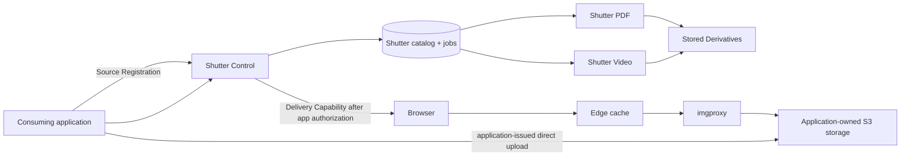

# Shutter architecture

## Purpose

Shutter centralizes media lifecycle concerns that would otherwise be duplicated
across applications: a media catalog, durable rendition jobs, controlled
delivery capabilities, and specialised execution. Consuming applications retain
their users, business records, storage provisioning, retention rules, and
end-user authorization.

## Topology

## Ownership

| Concern | Owner |
| --- | --- |
| End-user identity and authorization | Consuming application |
| Business metadata, such as listing order or archive entry | Consuming application |
| Bucket/prefix provisioning and retention | Consuming application |
| Direct-upload authorization and grant | Consuming application |
| Source Object bytes | Consuming application |
| Space configuration, Assets, Renditions, jobs, retries | Shutter |
| Image Optimization | imgproxy, configured by Shutter |
| Video and PDF materialization | Their Shutter Executors |

## Storage

A Shutter Space adopts one application-provided storage location at first:
provider, bucket, and optional prefix. A separate bucket per Space is the
preferred Railway isolation choice. Shutter's storage interface also permits a
distinct prefix in a shared bucket for small apps, but Railway does not document
prefix-scoped or read-only Bucket credentials; that arrangement is logical
organization rather than an access boundary.

Shutter stores references to Source Objects; it does not proxy uploads or become
the storage owner. Executors write Derivatives to the application-owned location
under Shutter-managed prefixes. The application issues direct-upload grants and,
after upload, performs Source Registration.

Railway Buckets are an S3-compatible storage choice, not a Shutter requirement.
They are private and belong to a Railway project and environment. Shutter never
stores an adopted Bucket's credentials. When it needs source bytes, it requests
a fresh Source Grant from the owning application. Railway variable references
and private service networking work only within one project and environment, so
cross-project Source Grant calls use a public custom domain with application
authentication.

## Image delivery

Image Optimization is request-driven:

1. A consuming application authorizes its user and obtains a Delivery Capability
   from Shutter when the Space is private.
2. Shutter obtains a fresh Source Grant and encrypts it inside a signed imgproxy
   source URL.
3. The browser requests that URL through an edge cache; imgproxy reads the
   permitted Source Object through the Source Grant.
4. The response resizes within the requested width and height, preserves
   composition, and WebP-encodes at requested quality.

The initial image surface is deliberately narrow: width, optional height, and
quality. It excludes caller-selected source URLs, crop modes, filters,
watermarks, and arbitrary output formats.

## Materialized work

Video posters and PDF covers are durable jobs. Shutter Control persists each job,
wakes the matching Executor over private networking, and records completion or
retry state. Each serverless Executor claims and completes at most one job per
invocation; it records a terminal outcome before returning. A recovery sweep
re-wakes jobs whose initial dispatch was missed.

Video and PDF have separate Executors from the beginning. imgproxy is also a
separate deployment because it is a standalone on-demand renderer.

Because imgproxy reads HTTPS Source Grants rather than `s3://` URLs, one central
imgproxy deployment can serve several Spaces without holding their Bucket
credentials. Its source URLs must be encrypted and signed. A spike must still
measure how Source Grant expiry affects cache reuse before this becomes the
default delivery path.

## Open choices

- The exact service-to-service authentication mechanism.
- Quality defaults and permitted values for Image Optimization.
- Private delivery-capability lifetime and cache policy.
- Source Grant lifetime, renewal, and cache-reuse behavior for imgproxy.
- Source-object deletion and derivative garbage-collection timing.
- The implementation language and package layout for Shutter Control and the
  two Executors.
