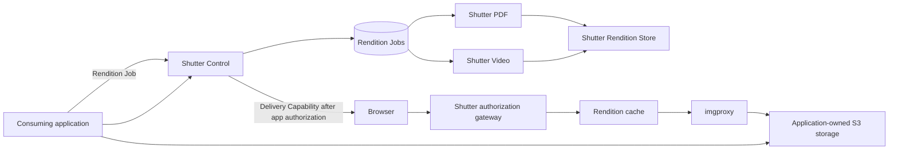

# Shutter architecture

## Purpose

Shutter centralizes rendition concerns that would otherwise be duplicated across
applications: on-demand image optimization, durable video and PDF thumbnail
jobs, controlled delivery, and specialised execution. Consuming applications
retain their uploads, media catalog, users, business records, storage
provisioning, retention rules, and end-user authorization.

## Topology

## Ownership

| Concern | Owner |
| --- | --- |
| End-user identity and authorization | Consuming application |
| Business metadata, such as listing order or archive entry | Consuming application |
| Source bucket/prefix provisioning and retention | Consuming application |
| Direct-upload authorization and grant | Consuming application |
| Source Object bytes | Consuming application |
| Media identity and source-to-rendition relationships | Consuming application |
| Space configuration, Rendition Jobs, attempts, retries | Shutter |
| Image Optimization | imgproxy, configured by Shutter |
| Generated and cached Rendition bytes | Shutter Rendition Store |
| Video and PDF materialization | Their Shutter Executors |

## Storage

Source Objects remain in application-owned storage. Shutter does not proxy or
coordinate uploads, store source Bucket credentials, or copy originals into its
own storage. A Rendition Job may retain the source reference and output metadata
needed for execution, but those operational records do not form a media catalog.

Shutter owns a separate Rendition Store containing only generated or cached
bytes. Object keys are deterministic from the Shutter Space, immutable source
identity, rendition kind, and normalized parameters. Applications retain the
meaningful relationship between their media records and returned Rendition
references. Private reads pass through the Shutter authorization gateway.

Optimized image bytes are disposable cache entries and may be evicted after a
Space-configured idle period or when the Space exceeds its storage budget. Video
posters and PDF covers are durable Derivatives retained until the consuming
application requests a Source Purge. A Source Purge removes every cached image
variant, stored Derivative, and operational Rendition Job for that immutable
source identity; revoking or allowing a Source Capability to expire removes
access but does not itself delete bytes.

## Image delivery

Image Optimization is request-driven:

1. A consuming application authorizes its user and issues a signed,
   time-limited Source Capability for one immutable Source Object.
2. The frontend combines that capability with permitted rendition parameters in
   a stateless Rendition URL; it does not call Shutter to mint the URL.
3. Shutter validates the capability and parameters, then sends a signed source
   request to imgproxy.
4. For a private Space, Shutter performs that validation before every cache
   lookup, including cache hits. Public Spaces may use ordinary CDN caching.
5. imgproxy reads only the permitted Source Object on a cache miss and returns
   the optimized response through the configured cache.
6. The response resizes within the requested width and height, preserves
   composition, and WebP-encodes at requested quality.

Cache policy is trusted Space configuration, not a caller-controlled query
parameter. Private cache objects use a stable key derived from immutable source
identity and normalized rendition parameters, so a refreshed Source Capability
can reuse existing bytes without extending the previous capability's access.

The initial image surface is deliberately narrow: width, optional height, and
quality. Width is normalized to the Space's canonical responsive ladder, height
is an optional bounding box, quality is normalized to the Space's permitted
values, and output is WebP. It excludes caller-selected source URLs, crop modes,
filters, watermarks, and arbitrary output formats.

The canonical width ladder is also passed explicitly to Unpic in each consuming
frontend. Shutter does not independently copy Unpic's package defaults: Unpic's
`constrained` layout adds the component width and twice that width to its default
resolutions, and package upgrades can change defaults. One shared integration
contract must therefore supply both Unpic breakpoints and Shutter normalization.

## Materialized work

Video posters and PDF covers are durable jobs. Shutter Control persists each job,
wakes the matching Executor over private networking, and records completion or
retry state. The Executor writes one canonical high-quality Master Preview to
the Rendition Store. Unpic and imgproxy then produce normalized responsive image
sizes from that master through the ordinary image-delivery pipeline rather than
scheduling size-specific video or PDF work. Each serverless Executor claims and
completes at most one job per invocation; it
records a terminal outcome before returning. A recovery sweep re-wakes jobs
whose initial dispatch was missed.

The v1 Master Preview contract is fixed: video captures the frame at one second
with a first-decodable-frame fallback, PDF renders the first page, and the result
is a composition-preserving quality-90 WebP within 1920 pixels. Callers cannot
select timestamps, pages, crop modes, or output formats.

The submitting application supplies a job-scoped Source Capability whose
lifetime covers the bounded retry window. Shutter does not call applications to
renew access and does not stage a copy of the original. If access expires before
completion, the job terminates as `source_expired`; the application may resubmit
the same idempotency key with a fresh capability.

Video and PDF have separate Executors from the beginning. imgproxy is also a
separate deployment because it is a standalone on-demand renderer.

Because imgproxy reads HTTPS sources authorized by Source Capabilities rather
than `s3://` URLs, one central
imgproxy deployment can serve several Spaces without holding their Bucket
credentials. Its internal source URLs must be encrypted and signed.

## Open choices

- The exact service-to-service authentication mechanism.
- The exact shared Unpic width ladder and permitted quality values.
- Private delivery-capability lifetime and cache policy.
- Rendition Job retry deadline and Source Capability lifetime.
- Source Capability lifetime and private cache enforcement.
- Image-cache idle periods and per-Space storage budgets.
- The implementation language and package layout for Shutter Control and the
  two Executors.
