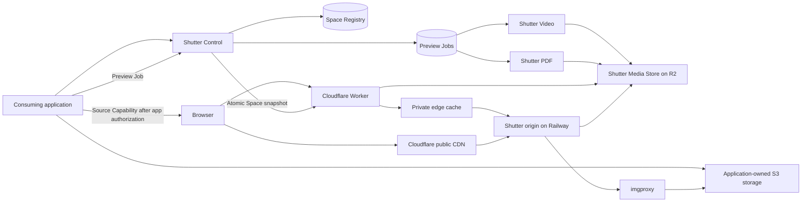

# Shutter architecture

## Purpose

Shutter centralizes media processing concerns that would otherwise be duplicated across
applications: on-demand image optimization, durable video and PDF thumbnail
jobs, controlled delivery, and specialised execution. Consuming applications
retain their uploads, media catalog, users, business records, storage
provisioning, retention rules, and end-user authorization.

## Topology



## Deployment boundary

Cloudflare is Shutter's delivery edge and durable media storage provider. A
Cloudflare Worker decrypts and validates private Source Capabilities before
every data-center-local edge-cache lookup and can read stored media through
an R2 binding; ordinary Cloudflare CDN caching serves canonical public
optimized images. Railway hosts Shutter Control, imgproxy, the isolated Executors, and
the job database. Executors write Master Previews to R2 through its
S3-compatible API.

Railway CDN caching is disabled or bypassed on private origin paths so it cannot
respond before Cloudflare authorization. Requests from Cloudflare to the
Railway origin carry a separate origin credential, and the origin rejects
untrusted direct access. The exact public canonical-URL routing remains subject
to an implementation spike.

Shutter Control emits allowlisted operational events as structured JSON to
Railway stdout and directly to the OpenObserve `default` log stream over
OTLP/HTTP JSON. The direct exporter is pinned to the exact OpenObserve ingest URL
and requires the complete authorization and stream header bundle before it can start.
Resource attributes identify the service, deployment environment, version,
replica, and region. Control also emits one completion event for each
non-health HTTP request using a server-generated request ID and the matched Hono
route template; it never records raw paths, queries, headers, bodies, locators,
capabilities, Source IDs, error messages, or stacks. Direct export is best effort
with an in-memory batch queue, while Railway stdout remains the independent
fallback. The operational procedure is in
[`runbooks/logging.md`](./runbooks/logging.md).

V1 launches on Workers Free with security-sensitive routes configured to fail
closed. A Cloudflare Free rate-limiting rule covers delivery paths, counts cached
requests, and initially blocks a client IP after 300 requests in a 10-second
window. The rule is an approximate abuse and cost guard, not an authorization
boundary: Cloudflare counters are data-center scoped and enforcement can lag.
Operations warn at 70,000 Worker requests in a UTC day and treat 90,000 as a
critical upgrade threshold. Normal traffic approaching the 100,000-request Free
limit triggers migration to Workers Paid; Shutter never bypasses private
authorization to remain under quota.

## Implementation stack

Shutter is a TypeScript pnpm workspace. Shutter Control and both Executors run
on Node with Hono; Drizzle manages the Postgres job schema; R2 is the Media
Store; imgproxy remains a separate upstream container image.

The Cloudflare edge app is a web-native Hono Worker. It uses `wrangler.jsonc` for
deployment configuration, the official Cloudflare Vite plugin for local workerd
execution, `wrangler types` for compatibility-date-specific bindings, Web Crypto
AES-GCM for Source Capabilities, and the Workers Cache API for private canonical
entries. It reads Space policies and Capability Keys from Control through an
authenticated snapshot endpoint. Tests run with Vitest's Cloudflare Workers
pool. The edge and shared
capability packages must not import Node built-ins or rely on `Buffer`; the
Worker does not enable `nodejs_compat` unless a measured future dependency makes
it unavoidable.

The Worker owns no database state and uses no D1, KV, or Durable Objects in v1.
Its only durable binding is the R2 Media Store. Jobs and operational metadata
remain in Postgres on Railway.

Postgres contains the Space Registry and the `preview_jobs` ledger. A registry
generation makes policy and credential changes visible as one snapshot. The job ledger's composite
identity is `(space_id, source_id, kind)`. The row holds only current operational
state: the opaque Source Capability while work is active, execution-cycle and
attempt counters, retry and lease timing, processing token, output metadata, and
sanitized failure code. There are no Asset, Source, attempt-history, purge,
delivery-token, or media catalog tables. Attempts are correlated in structured logs by
job identity, cycle, attempt number, and processing token.

The Source Capability column is cleared when a job becomes ready or terminal;
reactivation supplies a new valid capability. Source Purge deletes the job row.

Workspace packages are internal and are not published to npm in v1. Each consuming application keeps a thin local Shutter adapter for capability creation, Unpic
URL transformation, and job API calls. Shutter owns versioned protocol fixtures
for capability encryption, URL construction, width and quality normalization,
and API payloads; each consumer runs those fixtures as conformance tests. URLs
and capabilities carry an explicit `v1` version so incompatible drift fails
closed. A published SDK can be reconsidered if the consumer count grows.

## Ownership

| Concern | Owner |
| --- | --- |
| End-user identity and authorization | Consuming application |
| Business metadata, such as listing order or archive entry | Consuming application |
| Source bucket/prefix provisioning and retention | Consuming application |
| Direct-upload authorization and grant | Consuming application |
| Source Object bytes | Consuming application |
| Media identity and source-to-output relationships | Consuming application |
| Space policy configuration, Preview Jobs, attempts, retries | Shutter |
| Image Optimization | imgproxy, configured by Shutter |
| Generated and cached media bytes | Shutter Media Store |
| Video and PDF materialization | Their Shutter Executors |

## Space authentication

Each Shutter Space has separate server-only credentials for separate authority:
an API token authenticates job submission, status, and purge;
a capability-encryption key lets the consuming application issue stateless,
opaque Source Capabilities with authenticated encryption. Browser clients
receive only encrypted capabilities. Both credential types have key identifiers
and permit overlapping verification during rotation.
Source fetches are additionally limited to the Space's configured HTTPS origin
allowlist.

Only the Cloudflare Worker and Shutter Control hold capability-decryption keys.
The video and PDF Executors authenticate with separate role credentials that
permit them to claim only their own job kind; they are neither capability
issuers nor long-term capability-key holders.

V1 Source Capabilities are a strict discriminated union. `image_source`
authorizes Image Optimization of an application-owned original.
`source_delivery` authorizes unchanged Source Delivery. Both include a Source
Locator. `master_preview` authorizes delivery and resizing of an existing video
or PDF Master Preview, binds its kind, and contains no original locator.
`preview_job` authorizes materialization of one video or PDF kind and includes
the original locator. A route accepts only its designated purpose; capabilities
cannot be exchanged between Source Delivery, Image Optimization, stored-preview
delivery, and job submission.

## Space configuration

Space policies, API-token hashes, encrypted Capability Keys, status, and
credential history belong in the Postgres Space Registry. Tenant values are not
source code or deployment variables. Control reads Postgres for every
Space-scoped request and does not keep a policy cache.

Control also renders the small `/admin` operator surface. It uses a short-lived
session derived from an operator-managed bootstrap credential and protects every
write with a same-origin CSRF check. The interface calls the same Space Registry
contract as runtime code. Full API tokens and Capability Keys appear only in the
response that creates them; later pages show only their audit summaries.

Decommissioning blocks new Space-scoped requests and removes the Space from
Edge snapshots. Executor claims for jobs accepted before decommissioning can
still read the retained policy and currently accepted Capability Keys, so the
status change does not strand unfinished work.

Control returns one atomic, versioned snapshot to Edge. Each Edge isolate keeps
the last parsed snapshot for at most 60 seconds before it must refresh. It starts
a background refresh after 45 seconds. If Control is unavailable, Edge can use
the last snapshot for at most 10 minutes after Control generated it. This keeps
cache hits available during a short outage while putting a strict bound on
stale authorization. Executors receive only the allowed source-origin rules in
each claim; they do not load the registry.

After a successful refresh, Edge reports its generation to Control with the
dedicated snapshot credential. Control retains the latest report in process for
operator visibility; it is advisory and does not take part in authorization.

Deployment configuration, such as service URLs, the imgproxy allowlist, storage
credentials, and the dedicated Edge snapshot credential, belongs in Railway and
Cloudflare settings. Versioned URL shapes, capability formats, limits, and
parser rules remain protocol invariants in code and contracts.

## Storage

Source Objects remain in application-owned storage. Shutter does not accept or
coordinate uploads, store source Bucket credentials, or copy originals into its
Media Store. Source Delivery can stream an allowlisted Source Object through
the Worker and keep a complete object in the ephemeral Cloudflare cache. A
Preview Job may retain the source reference and output metadata needed for
execution, but those operational records do not form a media catalog.

Every source request separates an immutable application-issued Source ID from a
replaceable Source Locator. The Source ID drives cache keys, job idempotency,
Media Store keys, and Source Purge. A Source Locator supplies only the
current fetch path. A private Space can therefore keep the same SHA-256 Source ID while
moving its locator from a Railway presigned GET URL to an R2 presigned GET URL.

Publicly derivable sources use trusted Space-configured Source Resolvers. The v1
UploadThing resolver maps an allowlisted project and file key to its public HTTPS
location and fails closed when no project allowlist exists. Private Railway or
R2 objects use encrypted Source Capabilities that bind the Source ID to a
presigned HTTPS locator. Shutter accepts no arbitrary unsigned source URL.

Source Delivery and Image Optimization are sibling v1 routes. Source Delivery
supports only `GET` and `HEAD` and accepts no transformation query. It allows a
small set of image, video, and PDF content types and forwards only bounded media
metadata, range metadata, validators, and modification dates. A complete object
with a valid length of at most 512 MB can use the Cloudflare Cache API. Warm
range and conditional requests use that complete entry. Cold ranges and larger
objects stream from the origin and do not enter R2.

Shutter owns a separate Media Store containing only generated media
bytes. Object keys are deterministic from the Shutter Space, Source ID,
preview kind, and normalized parameters. Applications retain the
meaningful relationship between their media records and returned media
references. Private reads pass through the Shutter authorization gateway.

The v1 Media Store is Cloudflare R2. The Worker reads it through a native R2
binding after authorization; Railway Executors write Master Previews through
R2's S3-compatible API. Cache and master prefixes have separate lifecycle
policies so disposable Image Optimizations can expire without deleting durable
Master Previews.

Optimized image bytes under `cache/{space}/` are disposable cache entries with
an R2 lifecycle rule that deletes them 30 days after creation. V1 does not track
last access or enforce per-Space storage budgets. Video posters and PDF covers
under `masters/{space}/` are durable Master Previews retained until the consuming
application requests a Source Purge. A Source Purge removes every cached image
variant, stored Master Preview, and operational Preview Job for that Source ID;
revoking or allowing a Source Capability to expire removes access but does not
itself delete bytes.

## Source Purge

Source Purge is authenticated, idempotent post-revocation cleanup:

```http
POST /v1/spaces/{spaceId}/sources/{sourceId}/purge
```

Before calling it, the consuming application must make the Source Object
unavailable, stop issuing capabilities for it, and stop submitting work for it.
Shutter cannot use purge as instant authorization revocation: a still-valid
capability can recreate an optimized image while its Source Locator remains fetchable.

All Cloudflare cache entries for a source carry a tag derived from a hash of the
Space ID and Source ID. R2 keys group cached optimized images and Master Previews under
equivalent per-source prefixes. While serializing Control operations for that
source, Shutter invalidates its jobs, deletes all matching R2 objects through
paginated prefix listing, purges the Worker Cache API via Edge
`POST /internal/v1/cache/purge`, globally purges the Cloudflare zone cache tag,
and then returns `204 No Content`. The R2 deletion precedes both edge purges so a
concurrent edge request cannot repopulate a purged cache from a stored Master Preview.

The operation returns success only after R2, the Worker Cache API, and the zone
CDN tag are cleared. A partial failure returns a retryable service error;
repeating the same request safely repeats every step. A stale Executor whose
processing-token comparison fails must delete any output it uploaded (etag-
conditioned) and cannot recreate job state after purge.

## Image delivery

Image Optimization is request-driven:

1. A public application supplies a trusted resolver path, or a consuming
   application authorizes its user and issues an encrypted, time-limited Source
   Capability binding a Source ID to a Source Locator.
2. The frontend combines that source reference with permitted optimization
   parameters in a stateless Delivery URL; it does not call Shutter to mint the
   URL.
3. Shutter validates the resolver or capability and parameters, then sends a
   signed source request to imgproxy.
4. For a private Space, Shutter performs that validation before every cache
   lookup in the Cloudflare Worker, including cache hits. Public Spaces use
   ordinary Cloudflare CDN caching.
5. imgproxy reads only the permitted Source Object on a cache miss and returns
   the optimized response through the configured cache.
6. The response resizes to the normalized requested width, preserves composition,
   and WebP-encodes at requested quality.

Cache policy is trusted Space configuration, not a caller-controlled query
parameter. Private cache objects use a stable key derived from Source ID and
normalized optimization parameters, so a refreshed Source Capability
can reuse existing bytes without extending the previous capability's access.

Private image Source Capabilities live for 24 hours in v1. Public optimized
images use a 30-day Cloudflare edge TTL and the same 30-day R2 cache lifetime,
while browsers retain public responses for one day.
Public sources resolved directly, such as UploadThing, need no capability. When
a public source still needs a presigned locator, its capability authorizes an
origin miss only and is excluded from the CDN key; renewing it reuses the same
30-day cached optimized image.

Public responses use `Cache-Control: public, max-age=86400,
s-maxage=2592000`: Source Purge can invalidate Cloudflare and R2 immediately,
while the shorter browser lifetime bounds cache copies that Shutter cannot
recall from a user's device.

Private responses use `Cache-Control: private, no-store`. The Worker therefore
receives and validates a Source Capability for every network response instead
of allowing a browser cache to bypass Shutter authorization. Internally, the
Worker clones an authorized optimized image into its canonical Cache API key with a
24-hour edge TTL; the response sent to the browser retains `no-store`. Private
optimized objects remain eligible for the same 30-day R2 cache-object lifecycle,
and every read from either internal layer still sits behind Worker validation.

Public and private Spaces use distinct URL shapes. Public URLs use an allowlisted
Source Resolver when the fetch location is derivable; otherwise an encrypted
Source Capability supplies a presigned locator but is excluded from the public
CDN cache key. Private URLs keep the capability on the Worker-authorized route,
and the Worker derives a non-public canonical key only after decryption. Shutter
rejects a URL whose route class does not match the Space's configured policy.

The initial canonical delivery routes are:

```text
/v1/public/{space}/resolver/{resolver}/{sourceRef}?w=640&q=75
/v1/public/{space}/located/{sourceId}/{capability}?w=640&q=75
/v1/public/{space}/master/{kind}/{sourceId}?w=640&q=75
/v1/private/{space}/source/{capability}?w=640&q=75
/v1/private/{space}/master/{capability}?w=640&q=75
```

The public route accepts a resolver-specific, percent-encoded source reference.
The public located-source route uses an `image_source` capability only to
authorize an application-owned original fetch on a cache and R2 miss. Its clear
Source ID must match the authenticated claim and forms cache identity without
the capability. The public master route addresses an intentionally public
stored output by Source ID and `video` or `pdf` kind without a capability. The
private source route requires `image_source`; the private master route requires
`master_preview`. Every source reference and Source ID is a percent-encoded
single path segment. Unpic adapters modify only `w` and `q`.

A non-canonical public width or quality receives a `308 Permanent Redirect` to
the normalized URL, allowing the ordinary CDN to cache only canonical image
responses. The private Worker normalizes before deriving its internal cache key
and serves the response without a redirect. Missing parameters normalize to the
Space defaults only where a default exists: quality defaults to the Space value,
while width is required. Invalid, duplicate, and unknown query parameters fail
with an uncacheable `400` response rather than entering a cache key.

The initial image surface is deliberately narrow: width and quality. Width is
normalized to the Space's canonical responsive ladder, quality is normalized to
the Space's permitted values, and output is WebP. Height is not a transform
parameter. The surface excludes caller-selected source URLs, crop modes,
filters, watermarks, and arbitrary output formats.

imgproxy's v1 global ceilings are 128 MiB source size, 50 megapixels, one
animation frame, a 30-second download timeout, and two source redirects. These
security limits cannot be overridden by processing options. Loopback,
link-local, and private source addresses are disabled; allowed HTTPS origins are
explicit. The imgproxy deployment is not browser-addressable and requires both
an internal bearer credential and a signed processing URL from Shutter.

The canonical width ladder is also passed explicitly to Unpic in each consuming
frontend. Shutter does not independently copy Unpic's package defaults: Unpic's
`constrained` layout adds the component width and twice that width to its default
resolutions, and package upgrades can change defaults. One shared integration
contract must therefore supply both Unpic breakpoints and Shutter normalization.

Unpic `width` and `height` props still describe browser layout and intrinsic
aspect ratio, but each local Shutter transformer sends only the generated width
and configured quality to Shutter. CSS `object-fit` remains responsible for
covering or containing that preserved-composition image in its layout box. This
keeps `srcset` width descriptors accurate and prevents arbitrary heights from
forming a second cache-key dimension.

The v1 canonical widths are `320, 640, 750, 828, 960, 1080, 1280, 1668, 1920,
2048, 2560, 3200, 3840`; Unpic's 24px background placeholder is a separate
low-resolution request and an exact canonical exception outside that responsive
ladder. Demo Public permits qualities `30, 50, 75` and Demo Private
permits `30, 75, 80`, both defaulting to `75`. Master Preview encoding remains
fixed at quality `90`. Width normalizes upward and imgproxy never enlarges a
smaller source.

## Materialized work

Video posters and PDF covers are durable jobs. Shutter Control persists each job,
wakes the matching Executor over private networking, and records completion or
retry state. The Executor writes one canonical high-quality Master Preview to
the Media Store. Unpic and imgproxy then produce normalized responsive image
sizes from that master through the ordinary image-delivery pipeline rather than
scheduling size-specific video or PDF work. Each serverless Executor claims and
completes at most one job per invocation; it
records a terminal outcome before returning. Control serializes wake calls
independently for each Executor kind, and only a completed `200` wake counts as
successful; a `202` busy response remains a missed dispatch. A recovery sweep
re-wakes jobs whose initial dispatch was missed.

Postgres stores the submitted Source Capability as its original opaque,
authenticated-encryption blob, never as a plaintext Source Locator. When the
matching Executor claims a job, Control decrypts and revalidates the capability,
including Space, Source ID, purpose, preview kind, expiry, and origin policy.
The authenticated private claim response contains only the locator needed for
that attempt, deterministic output key, and processing token. The Executor holds
the locator in process memory for the attempt and never receives a capability
key. Video credentials cannot claim PDF jobs and PDF credentials cannot claim
video jobs.

The v1 Master Preview contract is fixed: video captures the frame at one second
with a first-decodable-frame fallback, PDF renders the first page, and the result
is a composition-preserving quality-90 WebP within 1920 pixels. Callers cannot
select timestamps, pages, crop modes, or output formats.

Video sources are limited to 512 MiB and PDF sources to 128 MiB. Exceeding the
type-specific ceiling is a terminal job failure.

The submitting application supplies a job-scoped Source Capability whose
lifetime is 24 hours. The underlying presigned Source Locator remains valid for
at least 24 hours and five minutes, while Shutter stops retrying at 23 hours.
Shutter does not call applications to renew access and does not stage a copy of
the original. If access expires before completion, the job terminates as
`source_expired`; the application may resubmit its canonical job URL with a
fresh capability.

Job completion is polling-based in v1. Idempotent submission returns an existing
ready Master Preview or a Preview Job reference. Applications poll that
resource with bounded backoff through `pending`, `processing`, `ready`, or a
terminal failure. A ready response includes a stable Master Preview descriptor:
Source ID, kind, actual dimensions, and WebP format. It never contains an
expiring URL or Source Capability. The application adapter constructs a public
master URL or, after end-user authorization, issues a `master_preview`
capability for the private route. Webhook completion may be added later without
changing job semantics.

Pending and processing job representations use `202 Accepted` with their
canonical `Location` and a `Retry-After` hint. Ready and persisted failed states
use `200 OK`; the JSON status and sanitized failure object describe the durable
resource state. Request rejection does not mutate a job, while temporary Control
or Postgres failure returns `5xx` for an idempotent retry.

One logical job exists for each `(space_id, source_id, kind)` tuple, where kind
is `video` or `pdf`. Its canonical resource is submitted with `PUT
/v1/spaces/{spaceId}/sources/{sourceId}/previews/{kind}`; no caller-generated job
ID or idempotency key is required. Repeating the same request returns the
current job and never creates a second Master Preview identity. A fresh Source
Capability submitted to a `source_expired` job reactivates that record with a
new retry window. A new valid `PUT` also reactivates `attempts_exhausted`, which
means temporary failures consumed one automatic five-attempt execution cycle.
Each reactivation starts a new bounded execution cycle on the same logical job.
Deterministic source failures remain unchanged unless the Source Object is
purged or changed bytes are submitted under a new Source ID.

Each job receives at most five attempts with retry delays of one minute, five
minutes, thirty minutes, and two hours. An attempt has a ten-minute hard timeout,
a fifteen-minute processing lease, and a one-minute heartbeat. A five-minute
recovery sweep requeues expired leases and work whose initial wake was missed.
Missing, unsupported, oversized, corrupt, or password-protected input is
permanently terminal for that Source ID. Network, Railway, R2, and
executor-process failures are retried automatically; consuming all five attempts
produces the manually resubmittable terminal result `attempts_exhausted`.

Failed polling representations expose only a stable failure code and recovery
action. `source_expired` directs the application to renew the capability,
`attempts_exhausted` permits a retry, deterministic media failures require a
replacement Source Object, and unexpected invariants direct the caller to an
operator. Presigned locators, upstream response bodies, stack traces, command
lines, and Executor stderr are never returned by the public API.

Video and PDF have separate Executors from the beginning. imgproxy is also a
separate deployment because it is a standalone on-demand renderer.

Because imgproxy reads HTTPS sources authorized by Source Capabilities rather
than `s3://` URLs, one central
imgproxy deployment can serve several Spaces without holding their Bucket
credentials. Its internal source URLs must be encrypted and signed.

## Workspace boundaries

Deployable apps are `edge`, `control`, `executor-video`, and `executor-pdf`.
Internal packages are `protocol` for Web-standard capability, URL, policy, and
API contracts; `testkit` for cross-runtime fixtures and conformance helpers; and
`executor-runtime` for the shared work cycle. Drizzle schema and migrations
remain private to Control because Executors claim through its authenticated API
rather than connecting directly to Postgres.
