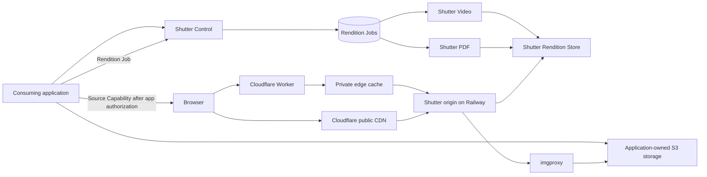

# Shutter architecture

## Purpose

Shutter centralizes rendition concerns that would otherwise be duplicated across
applications: on-demand image optimization, durable video and PDF thumbnail
jobs, controlled delivery, and specialised execution. Consuming applications
retain their uploads, media catalog, users, business records, storage
provisioning, retention rules, and end-user authorization.

## Topology

## Deployment boundary

Cloudflare is Shutter's delivery edge. A Cloudflare Worker decrypts and validates
private Source Capabilities before every data-center-local edge-cache lookup;
ordinary Cloudflare CDN caching serves canonical public Renditions. Railway
hosts Shutter Control, imgproxy, the isolated Executors, the job database, and
the central Rendition Store.

Railway CDN caching is disabled or bypassed on private origin paths so it cannot
respond before Cloudflare authorization. Requests from Cloudflare to the
Railway origin carry a separate origin credential, and the origin rejects
untrusted direct access. The exact public canonical-URL routing remains subject
to an implementation spike.

## Implementation stack

Shutter is a TypeScript pnpm workspace. Shutter Control and both Executors run
on Node with Hono; Drizzle manages the Postgres job schema; the Rendition Store
uses an S3-compatible Railway Bucket; imgproxy remains a separate upstream
container image.

The Cloudflare edge app is a web-native Hono Worker. It uses `wrangler.jsonc` as
configuration source of truth, the official Cloudflare Vite plugin for local
workerd execution, `wrangler types` for compatibility-date-specific bindings,
Web Crypto AES-GCM for Source Capabilities, the Workers Cache API for private
canonical entries, and Worker secrets for capability keys and the origin
credential. Tests run with Vitest's Cloudflare Workers pool. The edge and shared
capability packages must not import Node built-ins or rely on `Buffer`; the
Worker does not enable `nodejs_compat` unless a measured future dependency makes
it unavoidable.

The Worker owns no durable state and uses no D1, KV, Durable Objects, or R2 in
v1. Jobs, Rendition metadata, and durable bytes remain on Railway.

## Ownership

| Concern | Owner |
| --- | --- |
| End-user identity and authorization | Consuming application |
| Business metadata, such as listing order or archive entry | Consuming application |
| Source bucket/prefix provisioning and retention | Consuming application |
| Direct-upload authorization and grant | Consuming application |
| Source Object bytes | Consuming application |
| Media identity and source-to-rendition relationships | Consuming application |
| Space configuration, Rendition Jobs, attempts, retries | Shutter |
| Image Optimization | imgproxy, configured by Shutter |
| Generated and cached Rendition bytes | Shutter Rendition Store |
| Video and PDF materialization | Their Shutter Executors |

## Space authentication

Each Shutter Space has separate server-only credentials for separate authority:
an API token authenticates job submission, status, purge, and administration;
a capability-encryption key lets the consuming application issue stateless,
opaque Source Capabilities with authenticated encryption. Browser clients
receive only encrypted capabilities. Both credential types have key identifiers
and permit overlapping verification during rotation.
Source fetches are additionally limited to the Space's configured HTTPS origin
allowlist.

## Storage

Source Objects remain in application-owned storage. Shutter does not proxy or
coordinate uploads, store source Bucket credentials, or copy originals into its
own storage. A Rendition Job may retain the source reference and output metadata
needed for execution, but those operational records do not form a media catalog.

Every source request separates an immutable application-issued Source ID from a
replaceable Source Locator. The Source ID drives cache keys, job idempotency,
Rendition Store keys, and Source Purge. A Source Locator supplies only the
current fetch path. Pane View can therefore keep the same SHA-256 Source ID while
moving its locator from a Railway presigned GET URL to an R2 presigned GET URL.

Publicly derivable sources use trusted Space-configured Source Resolvers. The v1
UploadThing resolver maps an allowlisted project and file key to its public HTTPS
location and fails closed when no project allowlist exists. Private Railway or
R2 objects use encrypted Source Capabilities that bind the Source ID to a
presigned HTTPS locator. Shutter accepts no arbitrary unsigned source URL.

Shutter owns a separate Rendition Store containing only generated or cached
bytes. Object keys are deterministic from the Shutter Space, Source ID,
rendition kind, and normalized parameters. Applications retain the
meaningful relationship between their media records and returned Rendition
references. Private reads pass through the Shutter authorization gateway.

Optimized image bytes are disposable cache entries and may be evicted after a
Space-configured idle period or when the Space exceeds its storage budget. Video
posters and PDF covers are durable Derivatives retained until the consuming
application requests a Source Purge. A Source Purge removes every cached image
variant, stored Derivative, and operational Rendition Job for that immutable
source identity; revoking or allowing a Source Capability to expire removes
access but does not itself delete bytes.

## Image delivery

Image Optimization is request-driven:

1. A public application supplies a trusted resolver path, or a consuming
   application authorizes its user and issues an encrypted, time-limited Source
   Capability binding a Source ID to a Source Locator.
2. The frontend combines that source reference with permitted rendition
   parameters in a stateless Rendition URL; it does not call Shutter to mint the
   URL.
3. Shutter validates the resolver or capability and parameters, then sends a
   signed source request to imgproxy.
4. For a private Space, Shutter performs that validation before every cache
   lookup in the Cloudflare Worker, including cache hits. Public Spaces use
   ordinary Cloudflare CDN caching.
5. imgproxy reads only the permitted Source Object on a cache miss and returns
   the optimized response through the configured cache.
6. The response resizes within the requested width and height, preserves
   composition, and WebP-encodes at requested quality.

Cache policy is trusted Space configuration, not a caller-controlled query
parameter. Private cache objects use a stable key derived from Source ID and
normalized rendition parameters, so a refreshed Source Capability
can reuse existing bytes without extending the previous capability's access.

Public and private Spaces use distinct URL shapes. Public URLs use an allowlisted
Source Resolver when the fetch location is derivable; otherwise an encrypted
Source Capability supplies a presigned locator but is excluded from the public
CDN cache key. Private URLs keep the capability on the Worker-authorized route,
and the Worker derives a non-public canonical key only after decryption. Shutter
rejects a URL whose route class does not match the Space's configured policy.

The initial image surface is deliberately narrow: width, optional height, and
quality. Width is normalized to the Space's canonical responsive ladder, height
is an optional bounding box, quality is normalized to the Space's permitted
values, and output is WebP. It excludes caller-selected source URLs, crop modes,
filters, watermarks, and arbitrary output formats.

The canonical width ladder is also passed explicitly to Unpic in each consuming
frontend. Shutter does not independently copy Unpic's package defaults: Unpic's
`constrained` layout adds the component width and twice that width to its default
resolutions, and package upgrades can change defaults. One shared integration
contract must therefore supply both Unpic breakpoints and Shutter normalization.

## Materialized work

Video posters and PDF covers are durable jobs. Shutter Control persists each job,
wakes the matching Executor over private networking, and records completion or
retry state. The Executor writes one canonical high-quality Master Preview to
the Rendition Store. Unpic and imgproxy then produce normalized responsive image
sizes from that master through the ordinary image-delivery pipeline rather than
scheduling size-specific video or PDF work. Each serverless Executor claims and
completes at most one job per invocation; it
records a terminal outcome before returning. A recovery sweep re-wakes jobs
whose initial dispatch was missed.

The v1 Master Preview contract is fixed: video captures the frame at one second
with a first-decodable-frame fallback, PDF renders the first page, and the result
is a composition-preserving quality-90 WebP within 1920 pixels. Callers cannot
select timestamps, pages, crop modes, or output formats.

The submitting application supplies a job-scoped Source Capability whose
lifetime covers the bounded retry window. Shutter does not call applications to
renew access and does not stage a copy of the original. If access expires before
completion, the job terminates as `source_expired`; the application may resubmit
the same idempotency key with a fresh capability.

Job completion is polling-based in v1. Idempotent submission returns an existing
ready Master Preview or a Rendition Job reference. Applications poll that
resource with bounded backoff through `pending`, `processing`, `ready`, or a
terminal failure; a ready response includes the Master Preview reference and
dimensions. Webhook completion may be added later without changing job
semantics.

Video and PDF have separate Executors from the beginning. imgproxy is also a
separate deployment because it is a standalone on-demand renderer.

Because imgproxy reads HTTPS sources authorized by Source Capabilities rather
than `s3://` URLs, one central
imgproxy deployment can serve several Spaces without holding their Bucket
credentials. Its internal source URLs must be encrypted and signed.

## Open choices

- The exact shared Unpic width ladder and permitted quality values.
- Private delivery-capability lifetime and cache policy.
- Rendition Job retry deadline and Source Capability lifetime.
- Source Capability lifetime and private cache enforcement.
- Image-cache idle periods and per-Space storage budgets.
- The exact Cloudflare purge implementation.
- The final pnpm package names and import boundaries.
