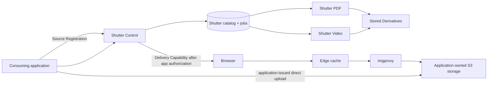

# Shutter architecture

## Purpose

Shutter centralizes media lifecycle concerns that would otherwise be duplicated
across applications: a media catalog, durable rendition jobs, controlled
delivery capabilities, and specialised execution. Consuming applications retain
their users, business records, storage provisioning, retention rules, and
end-user authorization.

## Topology

## Ownership

| Concern | Owner |
| --- | --- |
| End-user identity and authorization | Consuming application |
| Business metadata, such as listing order or archive entry | Consuming application |
| Bucket/prefix provisioning and retention | Consuming application |
| Direct-upload authorization and grant | Consuming application |
| Source Object bytes | Consuming application |
| Space configuration, Assets, Renditions, jobs, retries | Shutter |
| Image Optimization | imgproxy, configured by Shutter |
| Video and PDF materialization | Their Shutter Executors |

## Storage

A Shutter Space adopts one application-provided storage location at first:
provider, bucket, optional prefix, and credentials. A separate bucket per Space
is the preferred Railway isolation choice. Shutter's storage interface also
permits a distinct prefix in a shared bucket for small apps, but Railway does
not document prefix-scoped or read-only Bucket credentials; that arrangement is
therefore logical organization rather than an access boundary.

Shutter stores references to Source Objects; it does not proxy uploads or become
the storage owner. Executors write Derivatives to the application-owned location
under Shutter-managed prefixes.

Railway Buckets are an S3-compatible storage choice, not a Shutter requirement.
They are private and belong to a Railway project and environment. A Space may
therefore adopt a Bucket from another Railway project by storing that Bucket's
S3 credentials as sealed Shutter configuration. Railway variable references and
private service networking work only within one project and environment, so they
cannot connect an application project directly to the separate Shutter project.
Cross-project Shutter calls use a public custom domain with application
authentication; Shutter reaches the adopted Bucket through S3 credentials.
Rotating a Bucket credential requires updating the sealed Space configuration
in Shutter before the old credential is invalidated.

## Image delivery

Image Optimization is request-driven:

1. A consuming application authorizes its user and obtains a Delivery Capability
   from Shutter when the Space is private.
2. The browser requests a signed imgproxy URL through an edge cache.
3. imgproxy reads the permitted Source Object directly from storage.
4. The response resizes within the requested width and height, preserves
   composition, and WebP-encodes at requested quality.

The initial image surface is deliberately narrow: width, optional height, and
quality. It excludes caller-selected source URLs, crop modes, filters,
watermarks, and arbitrary output formats.

## Materialized work

Video posters and PDF covers are durable jobs. Shutter Control persists each job,
wakes the matching Executor over private networking, and records completion or
retry state. Each serverless Executor claims and completes at most one job per
invocation; it records a terminal outcome before returning. A recovery sweep
re-wakes jobs whose initial dispatch was missed.

Video and PDF have separate Executors from the beginning. imgproxy is also a
separate deployment because it is a standalone on-demand renderer.

For Railway-backed Spaces, the imgproxy deployment scope remains a deliberate
deployment choice. imgproxy expects one credential source with read access to
every Bucket named in its S3 source URLs. Railway documents Bucket credentials
per Bucket/project but does not document a shared multi-Bucket principal. Shutter
must therefore prove whether one imgproxy can safely read several adopted Railway
Buckets; otherwise the image renderer belongs beside each Space's Bucket.

## Open choices

- The exact service-to-service authentication mechanism.
- Quality defaults and permitted values for Image Optimization.
- Private delivery-capability lifetime and cache policy.
- Source-object deletion and derivative garbage-collection timing.
- The implementation language and package layout for Shutter Control and the
  two Executors.
- Whether one imgproxy credential source can read all adopted Railway Buckets,
  or renderers must deploy per Space.
